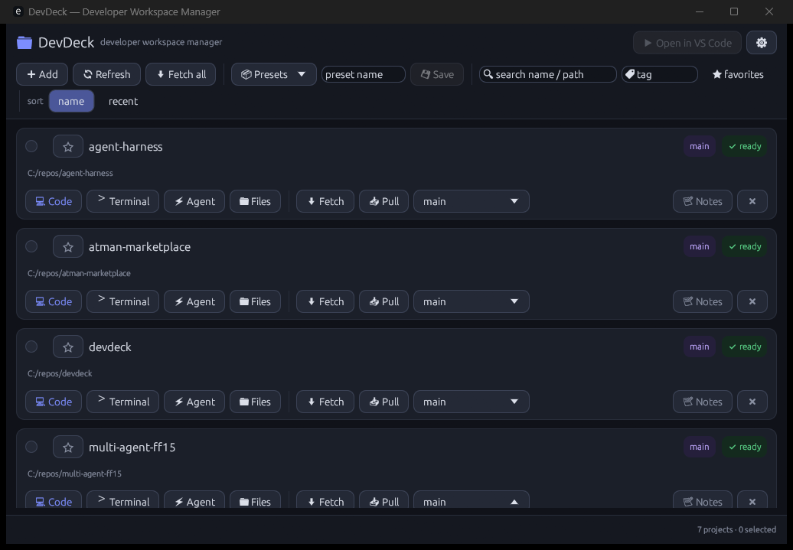

# DevDeck

**Developer Workspace Manager** — a fast hub for AI-driven, multi-repo development.

DevDeck is not just a VS Code launcher. In a development style where AI agents do
the implementation and humans check in to review, judge, and fix, DevDeck is the
human's home base: within seconds you can see which repositories are safe to work
on, open the ones you need, and resume where you left off.



## Features

- **Project registry** — register local folders, filter by name/tag, favorites, recent
- **Git status at a glance** — current branch, ahead/behind upstream (pull needed?),
  uncommitted changes (work in progress?), refreshed in the background
- **Open in VS Code** — select any number of projects and open them as a single
  multi-root workspace (single selection opens the plain folder)
- **Workspace presets** — save/load named selections of projects
- **Git operations** — Fetch / Pull (`--ff-only`) / branch switch per project
- **Launchers** — terminal, Windows Explorer, and an AI agent (Claude Code by
  default) in the project directory; all commands are customizable in Settings
- **Per-project notes & tags**
- **Session restore** — the projects selected when you quit are selected again on
  next launch

## Install

Requires Rust (and `git` + VS Code `code` command on PATH at runtime).

```powershell
cargo install --path .
```

This puts `devdeck.exe` in `%USERPROFILE%\.cargo\bin` (already on PATH for Rust
users), so you can launch it from any terminal — including mid-conversation with
an AI agent:

```powershell
devdeck
```

## Usage

1. **➕ Add projects** — pick one or more local repository folders.
2. Check the status badges per project:
   - `⎇ branch` — current branch
   - `↓N pull needed` — remote has commits you don't; pull before starting work
   - `↑N` — local commits not pushed
   - `● N changes` — uncommitted changes; the repo is mid-work
   - `clean` / `✓ up to date` — safe to start
3. Select projects with the checkboxes and hit **🚀 Open in VS Code**.
4. Save the current selection as a **preset** to reopen the same set later.

Ahead/behind counts compare against the last-fetched remote state; press
**⬇ Fetch all** (or per-project **Fetch**) to update them.

### Settings

`⚙ Settings` lets you customize the external commands (`{path}` is replaced with
the project path):

| Setting | Default |
|---|---|
| VS Code command | `code` |
| Terminal command | `wt -d {path}` |
| AI agent command | `wt -d {path} pwsh -NoExit -Command claude` |

## Data

Everything is stored in a single human-readable JSON file:
`%APPDATA%\devdeck\config.json`. Generated multi-root workspace files live in
`%APPDATA%\devdeck\workspaces\`.

## Architecture

| Module | Responsibility |
|---|---|
| `app.rs` | egui UI and application state |
| `models.rs` | domain types (`Project`, `Preset`, `Settings`, `GitInfo`, `Config`) |
| `git.rs` | git CLI integration (`status --porcelain=v2 --branch`, fetch/pull/switch) |
| `actions.rs` | external launches (VS Code, terminal, agent, explorer) |
| `storage.rs` | JSON persistence |

Design notes:

- **GUI**: [egui](https://github.com/emilk/egui) / eframe — pure Rust, single
  binary, instant startup; fits the "seconds-to-decision" goal.
- **Git**: shells out to the `git` CLI instead of libgit2, so fetch/pull reuse
  your existing credential helpers with zero auth configuration. All git calls
  run on background threads; the UI never blocks.
- **Extensibility**: launchers are template strings, so adding another agent or
  tool is a settings change, not a code change. The config file is versioned for
  future migrations.

## Development

```powershell
cargo test
cargo run
```

## License

MIT
